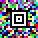
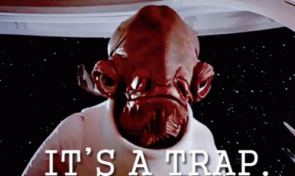
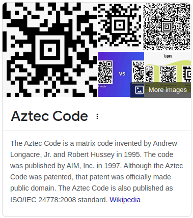
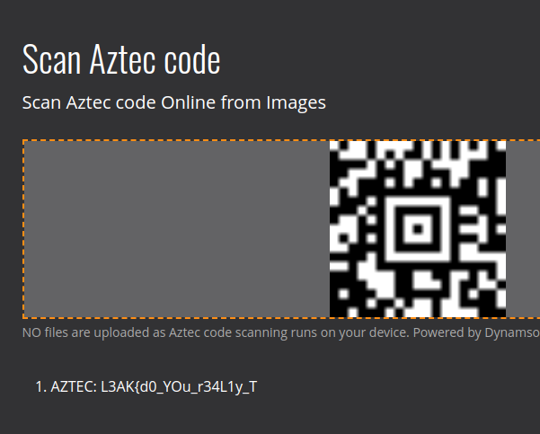

# Aztec - L3akCTF 2024
- Attachment: challenge.png 

The challenge asked who invented the technology, but.. it's a trap!

 

It's easy to see that the picture is an Aztec Code but if you try to use the authors as the flag, it won't work.

It can't also be read normally by websites like [this](https://www.dynamsoft.com/barcode-reader/barcode-types/aztec-code/) because of the colors.
The laziest way for me to get this flag was to use [aperisolve.com](https://www.aperisolve.com/) (full solution [here](https://www.aperisolve.com/be8790d43bc1abd455367ef8397ade88)), which gave me different black and white QRs.
When reading the 3 of them you get the whole flag as each color holds a bit of the final string.

 

:star::sparkles::star::sparkles::star::sparkles::star::sparkles::star::sparkles::star::sparkles::star::sparkles::star::sparkles:

> Final flag: **L3AK{d0_YOu_r34L1y_ThINk_7H3_aNCi3n7_4z7Ec5_kn3W_B4rc0De5}**

:star::sparkles::star::sparkles::star::sparkles::star::sparkles::star::sparkles::star::sparkles::star::sparkles::star::sparkles:
