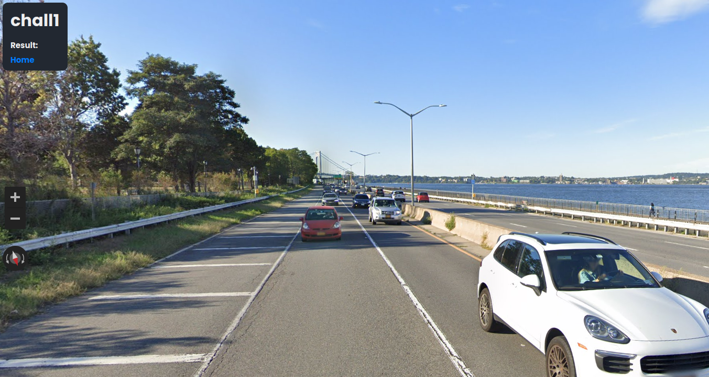
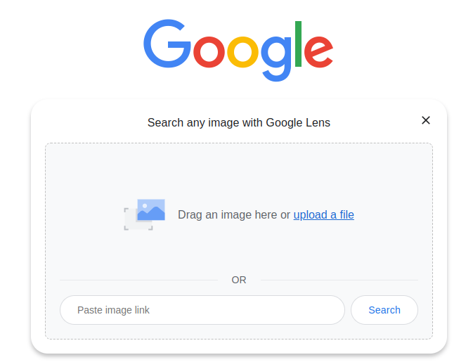
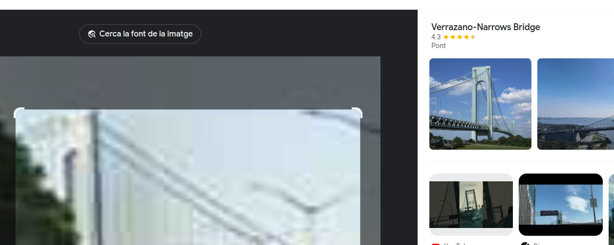
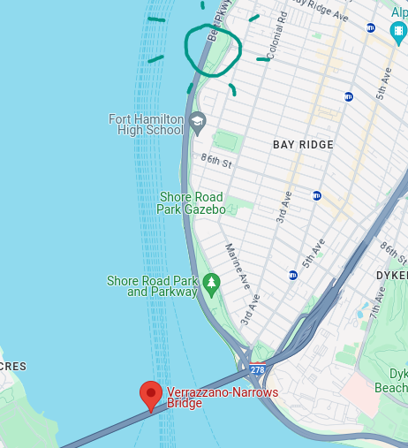
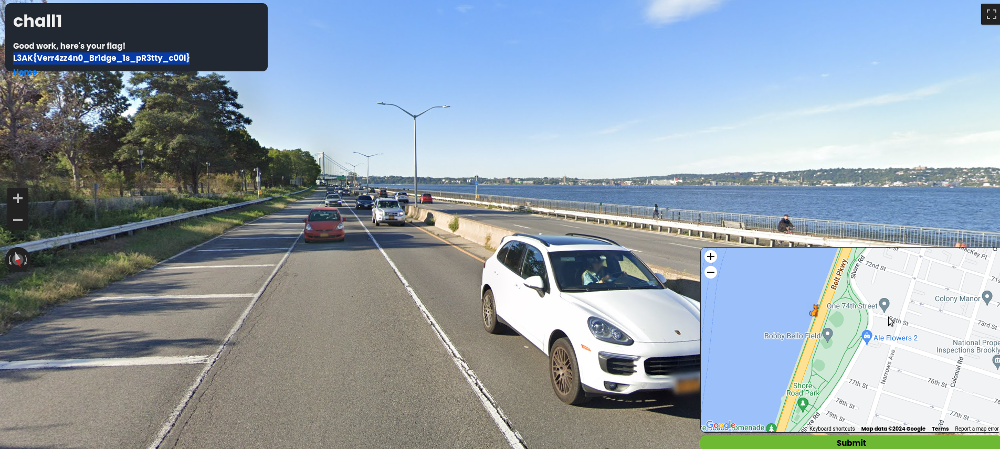

# Geosint 1 - L3akCTF 2024

The first thing we see that can be recognisable is the bridge in the far distance.

 

If we take a picture of that bridge and upload it to [Google Lens](https://lens.google.com), it will inmediatly tell us it's the Verrazzano-Narrows Bridge, in New York, US. *For lazy people: take a screenshot selecting an area > copy to clipboard > open google lens and paste it (press ctrl+v) there*

Ok so if we check it on [Google Maps](https://maps.google.com), and we move around trying to get the same image as in the challenge, we get that the solution is near the green area close to the bridge.

 
 

:star::sparkles::star::sparkles::star::sparkles::star::sparkles::star::sparkles::star::sparkles::star::sparkles::star::sparkles:

> Final flag: **L3AK{Verr4zz4n0_Br1dge_1s_pR3tty_c00l}**

:star::sparkles::star::sparkles::star::sparkles::star::sparkles::star::sparkles::star::sparkles::star::sparkles::star::sparkles: