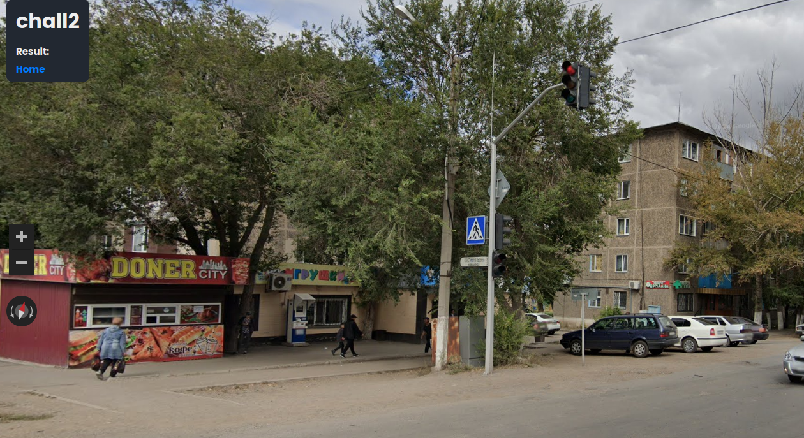
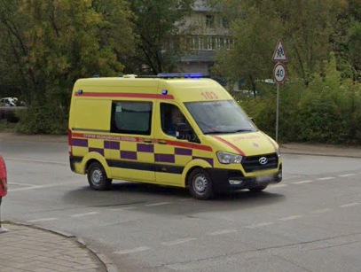
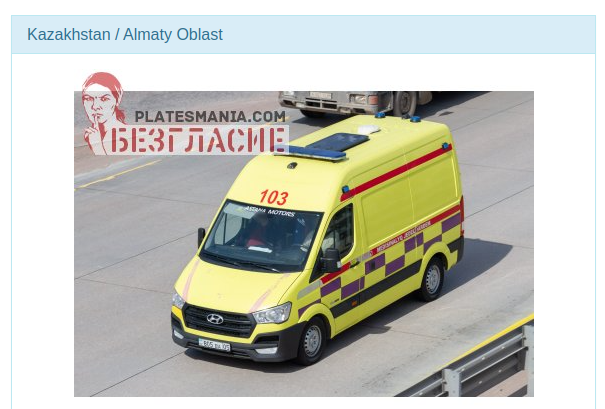
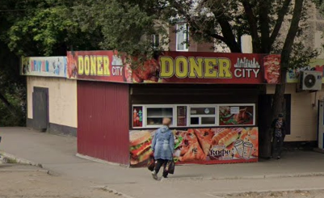
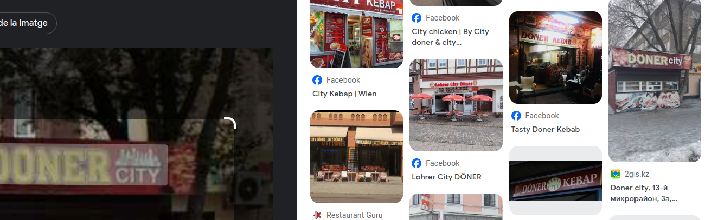
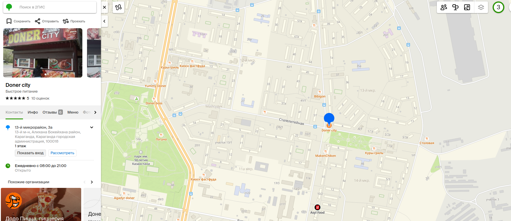
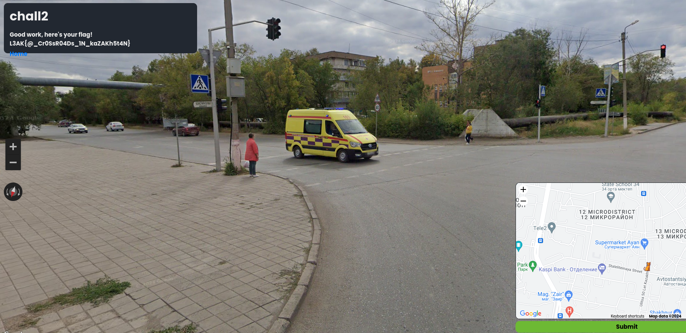

# Geosint 2 - L3akCTF 2024

For this one I don't wanna say I spent way too much time being lost.. but I did.

First I got the [country](https://platesmania.com/kz/nomer24351365?&lang=es?&lang=en) by checking the ambulance.

Then I looked into tons of other stuff, including a [pawn shop](http://lombard-astanalyk.kz/). All of this was not necessary because I eventually found the solution using Google Lens with the kebab place skdjaksdjaskl :weary::weary::weary: IT EVEN GAVE ME THE [EXACT LOCATION](https://2gis.kz/karaganda/gallery/firm/70000001029160469).

So completing it after that was ezpz lemon squeezy.

 

:star::sparkles::star::sparkles::star::sparkles::star::sparkles::star::sparkles::star::sparkles::star::sparkles::star::sparkles:

> Final flag: **L3AK{@\_Cr0SsR04Ds\_1N\_kaZAKh5t4N}**

:star::sparkles::star::sparkles::star::sparkles::star::sparkles::star::sparkles::star::sparkles::star::sparkles::star::sparkles: