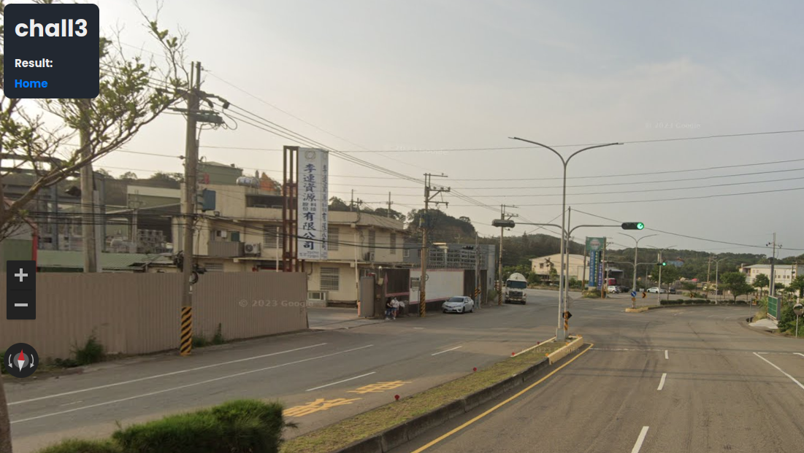
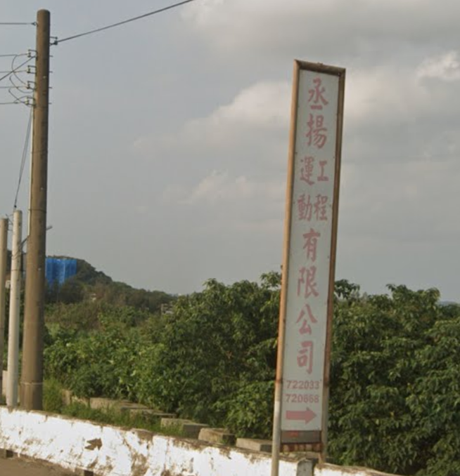
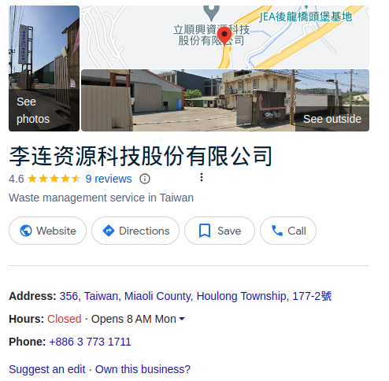
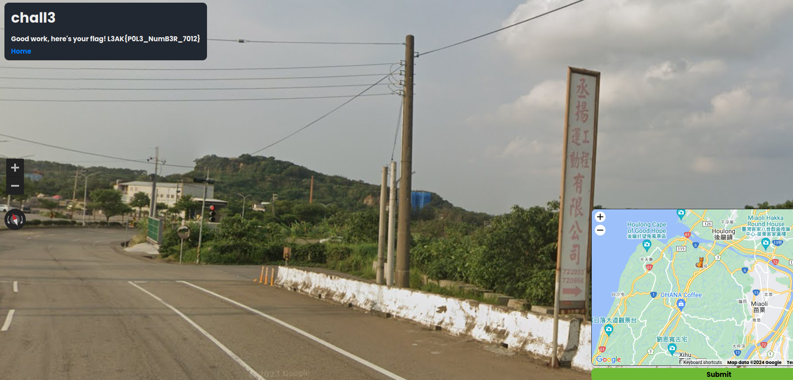

# Geosint 3 - L3akCTF 2024

This one had tons of signs with readable letters and numbers, so I found it quite fast.

I started with the following sign, which I got to read with Google Lens. After googling '丞揚運 有限公司 "720668"' I [found](https://www.arch-world.com.tw/vender/VenderKeylist.aspx?M=%E8%8B%97%E6%A0%97&P=5) that the location of the company is in the Miaoli County of Taiwan, but I couldn't get the exact address.

Afterwards I *Google Lensed* the post on the first picture, and I got "李連資源 有限公司", which I used to find the second company. It gave me a result in Google for the company itself.   

So I pointed it on the map and solved the mistery.

 

:star::sparkles::star::sparkles::star::sparkles::star::sparkles::star::sparkles::star::sparkles::star::sparkles::star::sparkles:

> Final flag: **L3AK{P0L3_NumB3R_7012}**

:star::sparkles::star::sparkles::star::sparkles::star::sparkles::star::sparkles::star::sparkles::star::sparkles::star::sparkles: