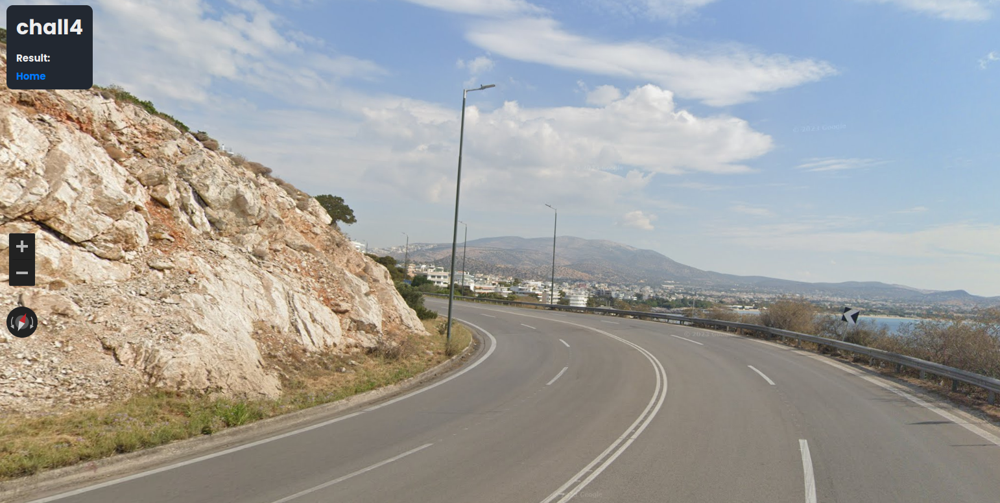
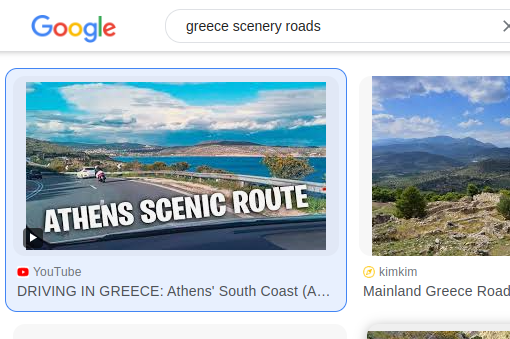
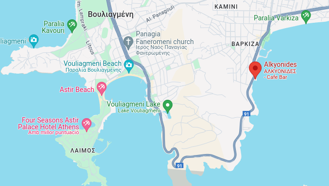
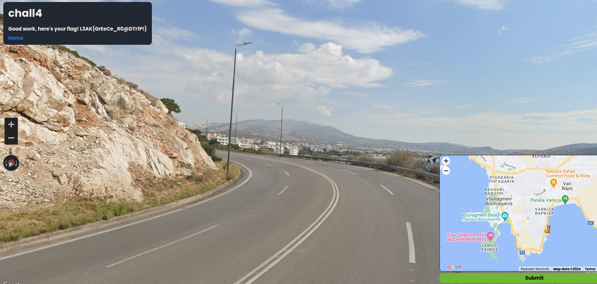

# Geosint 4 - L3akCTF 2024

This last one was quite challenging, as it didn't have anything very recognisable.

Using this [geohints](https://geohints.com/) website, I confirmed that it looks like a european country that has tons of islands... like Greece. Google Lens also gave me some results in Greece, but nothing very promising. 

Eventually, I started looking for "\[country\] scenery roads" just to try to get a road similar to the one on the picture. Aaaannd.. I got lucky. 

That [video on Youtube](https://www.youtube.com/watch?app=desktop&v=ssYN9F9XcsI) was clearly recorded going through the same road, so I watched it. It says it goes from Vouliagmeni to Lavrio, and before minute 5 it goes through the road I was searching. Right after that, it leaves behind a restaurant name Alkyonides which I was able to find on Google Maps, hence getting the coordenates to beat the last game.

 

:star::sparkles::star::sparkles::star::sparkles::star::sparkles::star::sparkles::star::sparkles::star::sparkles::star::sparkles:

> Final flag: **L3AK{GrEeCe_R0@DTr1P!}**

:star::sparkles::star::sparkles::star::sparkles::star::sparkles::star::sparkles::star::sparkles::star::sparkles::star::sparkles: